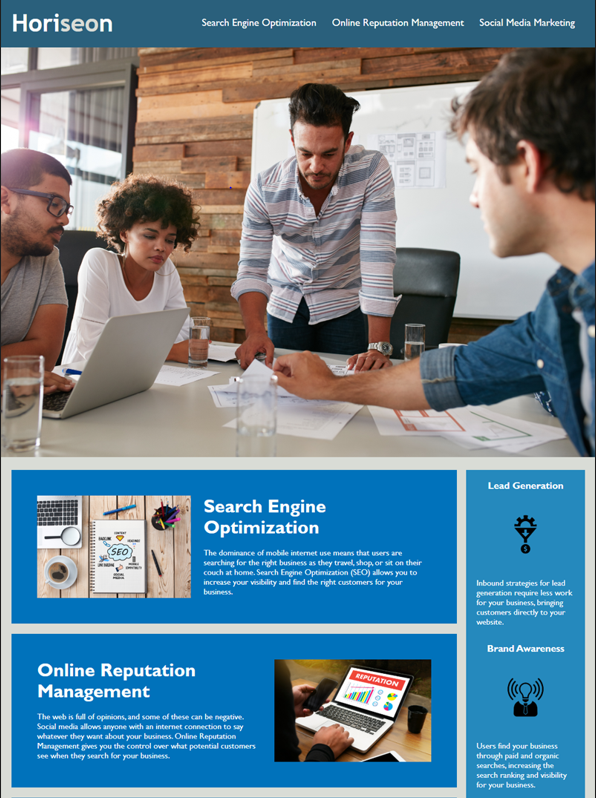

# Code Refactor 

## Improve web accessibility
 
This repository is where I refactored code for Horiseon website to  make it more accessible becauseweb accessibility is an increasingly important consideration for businesses. 
It ensures that people with disabilities can access a website using assistive technologies such as video captions, screen readers, and braille keyboards. Making a website accessible is also good for business for many reasons, one of them being that accessible sites are better positioned in search engines like Google. It also helps companies avoid litigation that can occur when people with disabilities cannot access their website.
This source code is available to everyone under the standard MIT license.
This site is deployed using [GitHub Pages](https://pages.github.com/) at https://kifeakor22.github.io/code-refactor/

## Installation

clone this repository to your local machine and open it using vs code 

## Contributing 

There are many ways in which you can participate in this project, for example:

* Submit bugs and feature requests, and help us verify as they are checked in
* Review source code changes
* Review the documentation and make pull requests for anything from typos to additional and new content

## License

Licensed under the MIT license

### Resources:

* [Semantic HTML](https://www.w3schools.com/html/html5_semantic_elements.asp)
* [Image `alt` attributes](https://www.w3schools.com/tags/att_img_alt.asp)
